# Lesson 03: Client-side data processing and UI enhancements 

## Overview 
In previous modules, we used an asynchronous HTTP request to load our GeoJSON data into the script at runtime. Within this lesson, we consider a technique for making multiple asynchronous HTTP requests to load geometry and data into the map script as separate requests (i.e., different files).

Once we do this, we use a nested looping structure to join attribute data to geometries within the client's browser to create a choropleth map. We then build an HTML standards-compliant UI (user interface) slider widget allowing the user to sequence through temporal data attributes and update the thematic map by dragging a slider widget.

## Table of Contents
<!-- TOC -->

- [Lesson 03: Client-side data processing and UI enhancements](#lesson-03-client-side-data-processing-and-ui-enhancements)
    - [Overview](#overview)
    - [Table of Contents](#table-of-contents)
    - [User Interaction II](#user-interaction-ii)
    - [Lesson objective](#lesson-objective)
        - [Working files](#working-files)
    - [Load multiple datasets and join by attribute](#load-multiple-datasets-and-join-by-attribute)
        - [Processing data client-side: binding attribute data to geometries](#processing-data-client-side-binding-attribute-data-to-geometries)
            - [Revisiting ways to loop over data](#revisiting-ways-to-loop-over-data)
            - [Binding the attribute data](#binding-the-attribute-data)
    - [Classifying the data and mapping to colors](#classifying-the-data-and-mapping-to-colors)
        - [Using Chroma.js for data classification and color mapping](#using-chromajs-for-data-classification-and-color-mapping)
    - [Updating the choropleth map](#updating-the-choropleth-map)
    - [Drawing the legend & slider](#drawing-the-legend--slider)
        - [Adding a slider UI to our map](#adding-a-slider-ui-to-our-map)
    - [Function design](#function-design)
    - [Visual design of the page and map](#visual-design-of-the-page-and-map)
    - [Addendum: Diving into CSS for full-screen maps](#addendum-diving-into-css-for-full-screen-maps)

<!-- /TOC -->

## User Interaction II

Begin by reading [Chapter Three of *The Shape of Design*](https://shapeofdesignbook.com/chapters/03-improvisation-and-limitations/), "Improvisation and Limitations." Limitations in creative work exist everywhere;  the medium imposes some restrictions while others can be self-imposed. Mapmakers have historically had the limitation of scale and have developed ingenious techniques to show an incredible density of information in a small area. The slippy map and its ability to toggle layers on and off have freed mappers from limitations of scale. However, we all have seen online maps that seem only to click and zoom; no one map state or view is compelling.

In recent years, [monochromatic mapping](https://somethingaboutmaps.wordpress.com/monocarto-2019-winners/) has gained popularity among cartographers because self-initiated limitations force one to develop new techniques by improvising with their toolkit. One learns how to vary symbol styles, e.g., line widths and patterns, in more subtle ways when altering color is not available. 

As you move forward designing maps and user interfaces, reflect on the value of imposing limitations in your creative development. When you're looking at an empty browser or code editor, and your Muse hasn't struck, self-initiated limitations can propel you forward. Use only one font, three colors, and five interaction states/events (e.g., modal on or off comprises two interaction states). While these limitations simplify your design choices, you might discover new ways of expressing your content. 

## Lesson objective

Proceed through the lesson before moving on the assignment and follow the guided tutorial to complete the demonstration map. Save your work and commit changes. We will display time-series data on a single map. Our final map will look and behave like this:

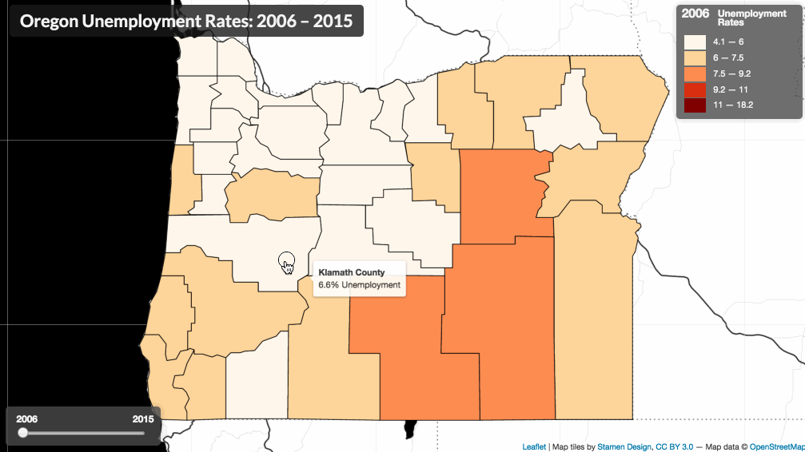  
*Final map made within Lesson 03*

The second part of the [assignment](assignment/) instructs you to make a similar map with a different dataset and geography.

### Working files

To follow along with this lesson, you should use the *index.html* file located in the *module-03/lesson/* directory. Note that this working directory includes two files: a data file named *or-unemployment-rates.csv* and a file containing GeoJSON data named *or-counties.json*.

Open the template *lesson/index.html* file starter file in your text editor, examine the document, and open the file in your web browser using a local server. You'll see that the geometries of Oregon counties are drawn to a Leaflet map with a black and white base map for reference.

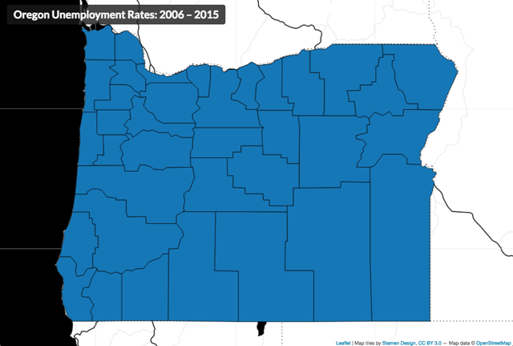  
*Starter map used in Lesson 03.*

The *index.html* file includes minimal CSS, HTML, and JavaScript within it. Read the code and understand how the script is currently working. After the Leaflet map is created and the Stamen tiles added to the map:

* The JQuery .getJSON() method makes an AJAX request and loads the *or-counties.json* file.
* When the file is loaded and available as the parameter `counties`, the script calls the `processData()` function, passing `counties` as an argument.
* The `processData()` function calls the `drawMap()` function, passing `counties` as an argument.
* The `drawMap()` function uses the GeoJSON data to create a L.GeoJson object with basic styles, adds it to the map, and then fits the map view to the extent of the layer.

You'll also notice that some empty functions have been declared (but not called).

If you examine the *or-counties.json* file, you'll notice the only feature attributes are state and county FIPS codes. There is no exciting data with which to create a thematic map. However, the *or-unemployment-rates.csv* file does contain such data as well as state and county FIPS codes.

Our goal moving forward is to load this CSV file, join the attribute data to the GeoJSON features (using the shared FIPS codes), and then create our choropleth map. We'll then add the UI slider element, allowing the user to update the map dynamically and sequence through the yearly timestamps.

Let's get started!

## Load multiple datasets and join by attribute

In Modules 01 and 02, we used an advanced technique known as AJAX to load an external file containing GeoJSON data. These data provided both the geometry information for drawing our SVG elements on the map (e.g., Kentucky counties) and the data attribute data (e.g., vacant housing rates for each county).

This module introduces the idea of keeping our geometry data and data attribute information in separate files and then using multiple AJAX requests to load these files independently. One reason for doing this is that storing information within a comma-separated values (CSV) file format is notably concise. Especially when you have many data attributes for each mapped unit (i.e., each county), the overall file sizes of keeping that data in CSV files are smaller than encoding within a GeoJSON file.

We introduce the process of programmatically joining data attributes with geometries, a "binding" process that has utility both in front-end client-side mapping (like we're doing), but also for pre-processing data files before they're using in a web mapping project. This technique is also applicable to when you stream live data into your map from a web resource and need to link the new data to geometries you've already drawn on the map.

Let's first get those data loaded into the DOM.

The first step is to load our GeoJSON data using the same technique we employed in Module 01, namely the JQuery method *.getJSON()*. If the file loads successfully, then the callback function will execute, and we'll have access to our GeoJSON data, which has been parsed by JQuery and preserved in the same JSON structure. We can, again, log the result to the Console to inspect our data now loaded into the script.

```javascript
$.getJSON("data/or-counties.json", function(counties) {

    // counties is accessible here
    console.log(counties);

});
```

One quick side note before we continue. What happens if we've been editing our GeoJSON data and we messed up its exact structure. The `.getJSON()` method would then be unable to parse it correctly. The method's callback function will not execute, but neither will the method by default throw an error or give us any indication that something went wrong. To deal with this, we need to "catch" the error. In the case of this JQuery method, we'll chain another method onto it called *.fail()*, which executes an anonymous function if the AJAX request and parsing of the file were unsuccessful. Its implementation looks like this:

```javascript
$.getJSON("data/or-counties.json", function(counties) {

    // did the data file successfully load?

})
.fail(function() {
    // the data file failed to load
    console.log("Ruh roh! An error has occurred." );
});
```

Okay, back to the data loading. Assuming JQuery successfully loaded and parsed our `or-counties.json` file, within the callback function, we want to issue our second AJAX request, this time loading an external CSV file named `or-unemployment-rates.csv`. Because CSV is a text format, just like our GeoJSON data, we can view these data using any text editor such as VS Code.

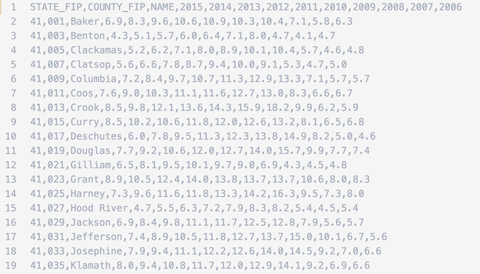  
*CSV data of OR unemployment rates over time.*

We can also open it using a spreadsheet/database program such as OpenOffice Calc or Microsoft Excel. However, be careful when using data containing Federal Information Processing Standards (FIPS) codes, such as we're doing for state and county identifiers. These programs will sometimes inadvertently strip the leading zeros from the identifiers and cause potential problems later in the script (e.g., Alabama's State FIP will be converted from 01 to 1). **It's often a good practice to keep values quoted as text strings within a CSV file for this reason.**

Thinking ahead for a moment, once we load the CSV data into our script, we ideally want it converted into a JSON format (i.e., an object consisting of key/value properties) within the user's client (browser). We want the first row of the CSV, the "header" row, to be the key names for this object, and the values for each row to be the values associated with those key names.

**Take home point:** When building a CSV file for web mapping, rows should contain the features and columns of the data attributes for those features.

Unfortunately, as awesome as JQuery is at handling AJAX requests, it (currently) lacks adequate support for loading CSV data and converting it to our desired JSON format. JQuery can easily load the CSV file as text, but then we would need to write our JavaScript to "parse" these data ourselves into our desired JSON format. While this could be a fun programming exercise, we want to get on with our mapping process. What's our solution then? Doing a web search for "jQuery CSV  or JavaScript CSV request" will turn up various options. Let's consider using an additional JavaScript library to do this for us!

[Papa Parse](http://papaparse.com/) bills itself as a "powerful, in-browser CSV parser for big boys and girls." Now that's the kind of confidence we want to see in a JavaScript library, right? Seriously, though, it's a sound library for this task.

To make use of it in our script, we need to load it, again, like we are loading our JQuery and Leaflet JS libraries. Within the head of our document, we'll make use of the `scr`attribute of a `script` tag, referencing Papa Parse's content delivery network (CDN) URL:

```html
<script src="https://cdnjs.cloudflare.com/ajax/libs/PapaParse/5.3.0/papaparse.min.js"></script>
```

Of course, we need to consult some of this [library's documentation](http://papaparse.com/docs) to see how to use this library (i.e., what methods are now available to us, what arguments they require, and what options are available). The following configuration appears to do the trick, and we can `console.log()` the parameter `data` that's passed within `Papa.parse()` method's callback function. Note that within that callback function, our GeoJSON `counties` data is also available.

```javascript
$.getJSON("data/or-counties.json", function(counties) {

    Papa.parse('data/or-unemployment-rates.csv', {

        download: true,
        header: true,
        complete: function(data) {

            // data is accessible to us here
            console.log('data: ', data);

            // note that counties is also accessible here!
            console.log('counties: ', counties);

        }
    }); // end of Papa.parse()

});  // end of $.getJSON()
```

Examining the output within the Console, let's understand the data structure returned by the `Papa.parse()` method. We first see that the library encoded 52 rows of data as a JSON object and assigned it to a property named `data`. Papa Parse has successfully converted our CSV tabular data into a JSON object. Furthermore, we should note that it has also encoded the numerical data values for each year as string types (we should remember this later, when we're using these data values).

The following animation shows us logging both the `counties` and the `data` to the Console and inspecting the output.

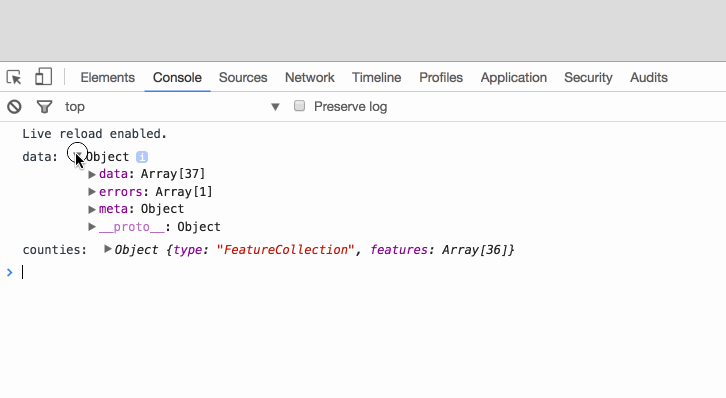  
*CSV data has been parsed into a JSON object.*

Great, now that we have our two data objects in the same place (our GeoJSON geometry data and the CSV attribute data converted to an array of objects), let's figure out a way to attach the attribute data from the CSV file to the GeoJSON geometry data. To do so, let's first get them out of these asynchronous callback functions and into a new function for processing. That's easy enough: we'll call a function and pass them as arguments:

```javascript
$.getJSON("data/or-counties.json", function(counties) {

    Papa.parse('data/or-unemployment-rates.csv', {
        download: true,
        header: true,
        complete: function(data) {

            processData(counties, data);

        }
    });

});
```

Next, let's create that function and write the code for client-side data processing.

### Processing data client-side: binding attribute data to geometries

We ended the previous section by calling a function we named `processData()` and passed two JS objects &ndash; our CSV attribute data and our GeoJSON geometry data &ndash; as arguments. As we know by now, if we call a function, such a function must exist! So we'll now create that function and define it with the necessary parameters to accept those arguments (we'll just retain the same names, `counties` and `data`):

```javascript
function processData(counties, data) {

    // code goes here

}
```

Now we're going to build a nested looping structure. That is, we're going to loop through one of the JSON objects properties, and for each time we do that, we're going to loop through all the properties of the second object. A nested looping structure is a fairly common technique in programming, but a little complicated to get your head around the first time, so read carefully and study the code and output you're writing.

#### Revisiting ways to loop over data

In most previous lessons, we have favored the classic three-statement `for` loop. As shown below, we are looping over an array of letters (the "outer" loop) and numbers (the "inner" loop) and Console logging their values. The first statement in the `for` loop runs before the first iteration, the second statement runs before each iteration and, if true, will continue looping, and third statement runs after each iteration. This benefit of using this `for` loop is that it has been around a long time and used by practically all browsers. The downside is that it's a rather verbose syntax, i.e., having to use bracket notation (and two variables) to access an array element.


```javascript
var letters = ["a", "b", "c", "d", "e"];
var numbers = [1, 2, 3, 4, 5];

for (var i = 0; i < letters.length; i++){
    for (var j = 0; j < numbers.length; j++){
        console.log(letters[i], numbers[j]); // what are these outputs?
    }
}
```

Now let's compare the [`for...of` statment](https://developer.mozilla.org/en-US/docs/Web/JavaScript/Reference/Statements/for...of) looping structure. Instead of returning the index value of the element, the iterating variable returns the element value. This loop makes a more compact and more comfortable reading syntax, but we still have to declare variable.

```javascript
const letters = ["a", "b", "c", "d", "e"];
const numbers = [1, 2, 3, 4, 5];

for (let i of letters){
    for (let j of numbers) {
        console.log(i, j); // what are these outputs?
    }
}
```

The last example of creating a loop is the [`.forEach()` method](https://developer.mozilla.org/en-US/docs/Web/JavaScript/Reference/Global_Objects/Array/forEach), which executes a function on each element in the array. The function takes one required argument, the current value of the element, which is pleasantly supplied by the `.forEach` method. The arrow function notation `=>` can be read as "pass this element into this function block." The advantages are simple, easy to understand syntax (if you have a little experience with [arrow functions](https://www.w3schools.com/js/js_arrow_function.asp)) and don't require declaring variables.


```javascript
const letters = ["a", "b", "c", "d", "e"];
const numbers = [1, 2, 3, 4, 5];

letters.forEach((i) => {
    numbers.forEach((j) => {
        console.log(i, j); // what are these outputs?
   })
})
```

All three looping methods do exactly the same thing and proof of the many ways one can arrive at a solution in programming. We even have more looping options with [`.some()`](https://developer.mozilla.org/en-US/docs/Web/JavaScript/Reference/Global_Objects/Array/some) and [`.every()`](https://developer.mozilla.org/en-US/docs/Web/JavaScript/Reference/Global_Objects/Array/every) that can allow breaking out of a loop. Which is best, you ask? The one you like the best. We'll use the `for...of` looping structure.

#### Binding the attribute data

Now examine the output logged to the Console. Within the inner loop, we can compare each of the first array's values with each of the second array's values.

In other words, as the two loops iterate through their values, we're able to at some point have every combination of values from the two arrays in the same place at the same time (in this case, logging them to Console).

How then do we apply this concept to our two JSON structures? Remember, our goal here is to bind the data within the CSV file with its associated geometries in the GeoJSON file. For this to happen, the elements within the two JSON objects **must share a unique identifier between them**. Without this, we can not bind the data and geometries.

Fortunately, these two data objects do share a unique identifier, namely the state FIPS (Federal Information Processing Standard) codes. Within the GeoJSON, these were encoded as values for a property named "COUNTYFP." Within the CSV file, the header row value of "COUNTY_FIP" designates the county's FIP id.

So then, our pseudo-code for binding these data is as follows:

* loop through the GeoJSON data's features
* for each state, loop through the CSV data
* if the FIPS code for the state matches that of the CSV data, add the CSV data to that GeoJSON feature's properties

First, let's review how our data are structured. Both are JSON objects. The `counties` variable has a key called `features` that contains the array of county features, including a key called `properties` with a field called `COUNTYFP`. The variable `data` has a key called `data` that contains an array of county unemployment rates by year and field called `COUNTY_FIP`.

Start with the basic looping structure and log the values to the Console to understand how the structure is accessing our data values. Again, we want the GeoJSON's `COUNTYFP` to match up with the CSV data's `COUNTY_FIP`.


```javascript
// loop through all the counties
for (let i of counties.features) {
    
    // for each of the CSV data rows
    for (let j of data.data) {
        
        // if the county fips code and data fips code match
        if (i.properties.COUNTYFP === j.COUNTY_FIP) {
            
            // console.log the values
            console.log('county fip: ', i.properties.COUNTYFP );
            console.log('data fip: ', j.COUNTY_FIP);
        }
    }
}
```

We can examine the FIPs codes within both the `counties` and the `data` objects by logging them to the Console.

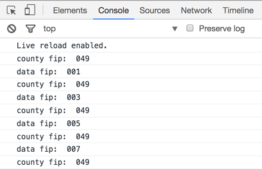  
*Nested looping structure through the counties GeoJSON and the CSV attribute data.*

Within the inner loop, we know that eventually each GeoJSON feature will be associated with its corresponding CSV (now JSON) property, and we can use a conditional statement within that inner loop to determine when this happens. If there is a match, we can replace the GeoJSON's properties with those of the CSV file.

```javascript
// loop through all the counties
for (let i of counties.features) {
    
    // for each of the CSV data rows
    for (let j of data.data) {
    
        // if the county fips code and data fips code match
        if (i.properties.COUNTYFP === j.COUNTY_FIP) {
      
        // re-assign the data for that county as the county's props
        i.properties = j;

        // no need to keep looping, break from inner loop
        break;
  }
}
```

We'll replace the GeoJSON's original properties here with all the CSV data since there's no other information in the GeoJSON beyond the FIP we wish to retain (if there were, we'd have to figure out a way to add or append the CSV data to the GeoJSON's properties). For instance, we could add another object property (`data`) and store the new data as its value (but **note that you'd need to modify the script accordingly below**):

```javascript
// if the county fips code and data fips code match
if (i.properties.COUNTYFP === j.COUNTY_FIP) {
    
  // re-assign the data for that county as the county's props
  i.properties.unemploymentData = j;

  // no need to keep looping, break from inner loop
  break;
}
```

Finally, since we know there should only be one match for each state, once we've made a match, we can use a `break` statement to break out of the inner loop and continue with the outer loop (this will help speed up the processing).

Once this nested looping structure is complete, our `counties` object should contain the data from the CSV within its properties. A trusty `console.log()` statement is used to verify this.

Log to console the value of `counties` after the looping structure to verify that the CSV data has been bound to the geometries' properties.

```javascript
} // end of outer loop

console.log('after: ', counties);
```

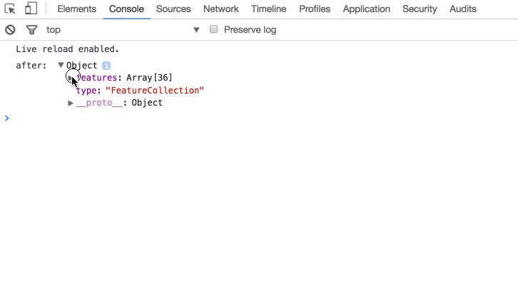  
*CSV data have now been bound to the GeoJSON features.*

We've now attached our attribute data to the GeoJSON data, and we're finally ready to create our map!

Of course, you may be thinking, "that was a lot of scripting work just to do what I could have first done with a table join in QGIS!" And you're correct.

But beyond JavaScript practice, this technique proves useful in a variety of scenarios when either your user may choose to load another data set from an external resource, upload their data for mapping, or when your map pulls in data automatically from an external resource or API.

Also, once a newer dataset is released, you only need to add one more column to the CSV file, and you're ready to go!

## Classifying the data and mapping to colors

One notable difference between this map and the interactive choropleth map we built-in Module 02 is how (and how many times) we classify the data within the script. As we know, classification methods are often a dicey business and drastically impact the message of the map.

In Module 02, we reclassified the data each time the user updated the map with a new data attribute (through the dropdown menu). This application makes sense, as we don't want to use the same class breaks for symbolizing vacant housing as we do for units with a mortgage (these two datasets have a different range and distribution of values).

However, the objective of the map we're building in Module 03 is to compare data attributes across time by dragging a slider widget, i.e., to visualize spatiotemporal patterns. In this case, we want to keep the data classification breaks constant to more easily compare map counties year to year and include the entire range of data. We'll, therefore, need to deviate from the Module 02 solution to **create the classification breaks one time within the script using the entire range of data values**.

Therefore, before we call the function to draw the map, within the `processData()` function, we can employ another nested looping structure to push all these values into an array (each timestamp attribute value for each county).

The following code snippet:

* creates an empty array to store all the data values
* iterates through all the counties
* iterates through all the props of each county
* conditionally tests each attribute to verify it's a timestamp value (and not one of our FIPS codes or the name of the county)
* pushes that value into an array, converting it to a number

```javascript
// empty array to store all the data values
const rates = [];

// iterate through all the counties
counties.features.forEach(function(county) {

    // iterate through all the props of each county
    for (const prop in county.properties) {

        // if the attribute is a number and not one of the fips codes or name
       if (prop != "COUNTY_FIP" && prop != "STATE_FIP" && prop != "NAME")  {

            // push that attribute value into the array
            rates.push(Number(county.properties[prop]));
        }
    }
});

// verify the result!
console.log(rates);
```

This block creates an array containing **all the data values** for each geographic unit (e.g., use state) for each year, at the beginning of the script. You might be scratching your head, thinking, the variable `rates` was assigned to an empty array with `const`. Shouldn't `const` prevent the overwriting of the variable's value? Yes, we cannot reassign the variable `rates`, but we can alter elements inside the array with the method like `.push()`. Let's now discover a new library that can both classify our and provide color values for each class.

### Using Chroma.js for data classification and color mapping

Next, we derive the class breaks from this range of data and apply those same breaks universally across the data attributes as they change (i.e., the yearly timestamps). Note that because the *or-unemployment-rates.csv data* is already a rate (a percentage), there's no need to normalize these data computationally within our JavaScript.

In previous modules, we used the Simple Statistics JS library to do some heavy lifting for us when calculating class breaks. Then we wrote our custom color function to return a specific color given a particular attribute value.

In this lesson, we introduce yet another JS library we can use: [Chroma.js](http://gka.github.io/chroma.js/#chroma-scale), a "tiny JavaScript library (12kB) for dealing with colors!" You should follow that link and read through some of the documentation and examples. While most of it just deals with methods to return various colors, there are also some helper methods that [computes class breaks](http://gka.github.io/chroma.js/#chroma-limits), [map numeric values to a color](http://gka.github.io/chroma.js/#chroma-scale), and returning [distinct sets of colors](http://gka.github.io/chroma.js/#scale-classes) (useful for classed choropleth maps!).

To use the library, we need to load it into our script:

```JavaScript
<script src="https://cdnjs.cloudflare.com/ajax/libs/chroma-js/2.1.0/chroma.min.js"></script>
```

After we've built the giant array of all the data values (and verified no FIPS codes snuck in there!), we can write the following two statements that do a lot of work for us:

* First, determine class breaks (here using our `rates` array, a quantile method, and 5 classes)
* Create a color generator function using ColorBrewer's Orange-Red color scheme that returns a color based on where an input value fits within the 5 classes of colors using our break values. The colors along the color gradient are interpolated using the Lab color space. We assign this function to the variable name `colorize`.

```JavaScript
// create class breaks
var breaks = chroma.limits(rates, 'q', 5);

// create color generator function
var colorize = chroma.scale(chroma.brewer.OrRd).classes(breaks).mode('lab');
```

This is subtle but important. What data type is `colorize`? If log it to console, we see that it is a function:

```JavaScript
console.log(colorize) // function (a){var b;return b=s(u(a)),m&&b[m]?b[m]():b}
```

You may need to go back to MAP672 to read about functions, but if you recall, there are two types of functions: **function declarations** and **function expressions**.

We've mainly been writing function declarations, but in this case, `colorize` is written as a function expression. This means 1.) it must be written above where it is used in the script (is not hoisted), and 2.) can be passed arguments implicitly.

For example, try the following code:

```javascript
var color = colorize(20);
console.log(color); // a {_rgb: Array[4]}
```

The return value is an RGB value (a color value!) we can use within our script.

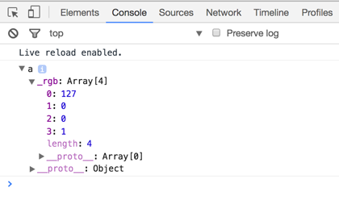  
*Output of a single value passed to colorize function expression.*

We're using these methods of Chroma.js to return a color, rather than building our own `getColor()` function (if you peek beneath the hood, Chroma.js is doing something similar).

We're now ready to create the choropleth map.

Call the `drawMap()` function at the bottom of the `processData()` function, passing both the `counties` GeoJSON object and the `colorize` function as arguments. Yes, we can pass functions as arguments to other functions!

## Updating the choropleth map

We're using the similar logic we employed with Lesson 02 within this map: 1.) first draw the map using one function, and 2.) update the map with the colors using a second function. This way, once we build the UI slider widget, we can repeatedly call the `updateMap()` function to re-colorize the map.

After the GeoJSON data is converted to the L.GeoJson object and drawn to the map, call the function to update the map. Pass the reference to the L.GeoJson object (`dataLayer`) and the `colorize` function (note that `colorize` has simply been passed through the `drawMap()` function and not used within it).

We also want the `updateMap()` function to initially draw the map using a specific timestamp, so we can hardcode the value for the first year and pass that as an argument as well (we're trying to avoid using global variables now within this lesson script):

```javascript
updateMap(dataLayer, colorize, '2006');
```

Next, update the parameters and write code within the `updateMap()` function to loop through the counties (using the Leaflet `.eachLayer()` method) and apply a `colorFill` value, using the `colorize` function we created using Chorma.js. You'll want to be sure you're using the numeric value to do so. This example assumes there is a `currentYear` parameter within the function that references the value '2006' passed from the caller.

```javascript
fillColor: colorize(Number(props[currentYear]))
```

When this is complete you should have a working map that looks something like this (eek, yes, a choropleth projected in Web Mercator ... LOL kittens are dying):

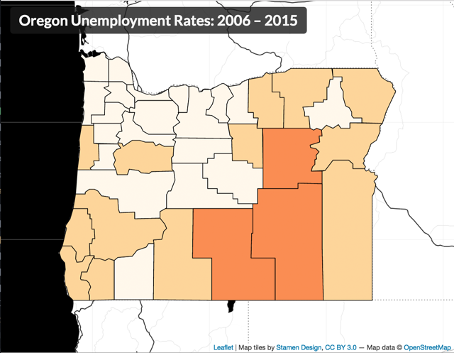  
*Map colored as a classed choropleth.*

## Drawing the legend & slider

Next, we'll draw the legend. Remember that because we're setting the classification breaks once for all the timestamps, we only need to call one function (`drawLegend()`) once. We can call this function up in the `processData()` function (where we call `drawMap()`), and pass `breaks` and `colorize` as arguments.

Building the legend, like all of web map design, involves HTML, CSS, and JavaScript. We won't write the actual HTML markup ourselves into the document, but again we'll allow Leaflet's JS to create the division element (with a class attribute value of `legend` for styling with CSS) and add it to the map:

* create a Leaflet control for the legend
* when the control is added to the map
* create a new division element with class of 'legend'
* return the new element
* add the legend control to the map


```javascript
// create a Leaflet control for the legend
const legendControl = L.control({
    position: 'topright'
});

// when the control is added to the map
legendControl.onAdd = function (map) {

    // create a new division element with class of 'legend' and return
    const legend = L.DomUtil.create('div', 'legend');
    return legend;

};

// add the legend control to the map
legendControl.addTo(map);
```

We can now select that element with JS using the class attribute of `legend` and loop through our break values, creating new elements. This solution is different than the legend solutions previously proposed and uses an unordered list and list item for each class range:

* select the newly created legend, select and populate the heading, creating an unordered list for the class ranges and store as a reference to a variable
* loop through the break values
* access the color for each class range
* build a list item with color block and values
* append the list item to the list
* close the unordered list

```javascript
// select div and create legend title
const legend = $('.legend').html("<h3><span>2006</span> Unemployment Rates</h3><ul>");

// loop through the break values
for (let i = 0; i < breaks.length - 1; i++) {
    
    // determine color value 
    const color = colorize(breaks[i], breaks);

    // create legend item
    const classRange = `<li><span style="background:${color}"></span>
        ${breaks[i].toLocaleString()}% &mdash;
        ${breaks[i + 1].toLocaleString()}$ </li>`

    // append to legend unordered list item
    $('.legend ul').append(classRange);
}
// close legend unordered list
legend.append("</ul>");
```

We've now built the structure for the legend. But it's going to need CSS rules for proper display.

You'll want to experiment with the various CSS property values to achieve your own design. However, for reference we used the following CSS rules for this demonstration (again, these are similar to those already employed in the previous modules, though this time we're selecting the `ul` and `li` elements for styling):

```css
.legend {
    padding: 6px 8px;
    font-size: 1em;
    background: rgba(75, 75, 75, 0.8);
    color: whitesmoke;
    box-shadow: 0 0 15px rgba(0, 0, 0, 0.2);
    border-radius: 5px;
    width: 160px;
}

.legend h3 {
    font-size: 1.1em;
    font-weight: bold;
    line-height: 1em;
    color: whitesmoke;
    margin: 0;
}

.legend h3 span {
    font-size: 1.3em;
    margin: 0 20px 0 0;
}

.legend ul {
    list-style-type: none;
    padding: 0;
    margin: 12px 4px 0;
}

.legend li {
    height: 22px;
}

.legend span {
    width: 30px;
    height: 20px;
    float: left;
    margin-right: 10px;
}
```

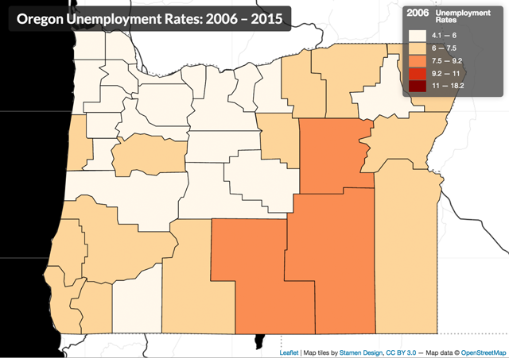  
*Map with legend added.*

We now have a basic static choropleth map drawn to the map. Time to add user interaction!

### Adding a slider UI to our map

Once we've drawn the map and initially updated our map with a single year's data, we want to give the user the power to change the map by sequencing through our data attributes (in this case, yearly unemployment rates per county).

This lesson introduces you to another convenient HTML element used to build a slider widget. We use the same HTML element, the `input` element, as we used for the dropdown ([https://developer.mozilla.org/en-US/docs/Web/HTML/Element/Input](https://developer.mozilla.org/en-US/docs/Web/HTML/Element/Input)). Like with the dropdown form element we built in Module 02, we'll create this HTML element within the DOM by directly writing it within the HTML (rather than creating the element dynamically with the JavaScript).

```html
<div id="map"></div>
<div id="ui-controls">
    <input type="range" min="2006", max="2015",
            value="2006", step="1" class="year-slider"></input>
</div>
```

We're going to give it a different type attribute value, though, a recent addition to the HTML5 specification known as `range` (see the section under [Sliders](https://developer.mozilla.org/en-US/docs/Web/Guide/HTML/Forms/The_native_form_widgets) here).

We also write several other attributes into the input element when we write it with the HTML. In this example, we're necessarily hard-coding these values in so they correspond with our data. We know, looking at our CSV data, that we want to slide from an initial minimum value of 2006 to a maximum value of 2013. We also know we have data attributes for every year (i.e., whole integer) between these years, so we want the increment level to be one. We encode these values into the input element using the attributes `min`, `max`, `value` (which sets the initial slider widget position when the element loads in the DOM), and `step`.

Note that if our data were, say, decennially census data, we could make the `step` attribute value 10, and the slider would register changes in values of 10 with each step. We want to place this HTML code up within the `<body>` tags, either above or beneath our `<div id="map"></div>` element (since we'll be dynamically placing it on the map, it doesn't matter where in relation to this element the code is written within the HTML).

We'll also give our input element a class named `year-slider` and wrap it within a div element with an id attribute of `ui-controls`. We use these class and id attributes for both styling elements with CSS rules and selecting them with the JavaScript.

Now that we have the HTML in place let's add some CSS rules for styling. In your actual development, the process may be much more iterative, placing HTML elements one at a time and creating the style rule for each.

```css
#ui-controls {
    width: 176px;
    padding: 8px 25px 8px 15px;
    background: rgba(75, 75, 75, 0.8);
    box-shadow: 0 0 15px rgba(0, 0, 0, 0.2);
    border-radius: 5px;
    color: whitesmoke;
}

#ui-controls .min {
    float: left;
}

#ui-controls .max {
    float: right;
    margin-right: -15px;
}

.year-slider {
    width: 100%;
}

label {
    font-size: 1.1em;
    font-weight: bold;
}
```

Saving and refreshing the page will not display this range slider because it is still stacked beneath the map. Time to write more JavaScript.

We'll encapsulate the JavaScript code we write to create this UI element within a single function. We can name this function `createSliderUI()`.

We'll also need to call this function, obviously, and as usual, we need to think carefully about where we want to call it. What will this function do?

* select the HTML input form we've built
* listen for changes
* call the function to update the map, passing the current value of the range slider to the `updateMap()` function.

We know it's going to call the `updateMap()` function, which currently as we've written it accepts three arguments:

```javascript
function updateMap(dataLayer, colorize, currentYear) {
    // code here
}
```

Therefore, we need the call from the `createSliderUI()` function to pass the three required arguments. Even though we're not using `dataLayer` and `colorize` for the UI slider, we still need to pass these into the function so they can be passed along to the `updateMap()` function (unless they are global variables, which we're trying to avoid).

So we need to call the function where these arguments are available, which is within the `drawMap()` function, after the map has been drawn (and perhaps before we initially call to update the map):

```javascript
createSliderUI(dataLayer, colorize);
```

Now let's write the code within the `createSliderUI()` function.

While we could use CSS absolute positioning to add these elements atop our map, similar to the h1 element, we can also use Leaflet to do this. We used Leaflet's `L.control()` class to create a dynamic legend and add it to the map. This example is similar; however, rather than using Leaflet's methods to create a new DOM element, we're using the statement `L.DomUtil.get("ui-controls")` to select that `<div>` element we just manually wrote into our HTML (storing a reference to it with as `var sliderControl`).

The following code:

* creates a Leaflet control object and store a reference to it in a variable
* when we add this control object to the map,
* selects an existing DOM element with an id of "ui-controls"
* disables scrolling of map while using controls
* disables click events while using controls
* returns the slider from the onAdd method
* add the control object containing our slider element to the map


```javascript
// create Leaflet control for the slider
const sliderControl = L.control({ position: 'bottomleft'} );

// when added to the map
sliderControl.onAdd = function(map) {

    // select an existing DOM element with an id of "ui-controls"
    const slider = L.DomUtil.get("ui-controls");

    // disable scrolling of map while using controls
    L.DomEvent.disableScrollPropagation(slider);

    // disable click events while using controls
    L.DomEvent.disableClickPropagation(slider);

    // return the slider from the onAdd method
    return slider;
}

// add the control to the map
sliderControl.addTo(map);
```

Note the two curious statements using the `L.DomEvent` class. What are those doing? Without them, the slippy map panning functionality also occurs when the user uses the range slider, annoyingly moving the map when the user drags the slider widget across the track. (This may be undetected because we've disabled dragging and zooming in the initial map creation, but it's good to use for future maps. Uncomment to find out!)

If we now save our file, we'd see we have added our range slider to the map and we can slide the widget along the widget's track.

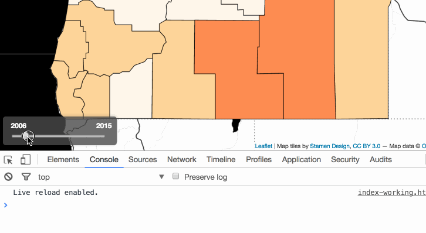  
*Slider widget built from the HTML5 input range.*

However, it's currently not updating the map. Like the dropdown menu we built in Module 02, we again need this element to "listen" for user interaction. We need to write this functionality into our code.

Just as we used a JQuery method to detect the UI change in a dropdown menu, we'll do the same to recognize when the user is sliding the input range element and call the function to update the map then.

* We'll first select our input element using the class attribute value we gave it: `$(".year-slider")`.
* We then chain the JQuery `on()` method to this selection and pass the string argument `'input change'`, which listens for changes to this input element.
* Upon a change, the callback function is fired where it assigns the variable `currentYear` with `.value` property of the slider.
* We then select the span element nested in the legend > h3 element and replace the HTML with the contents of `currentYear`.
* Once we have this value, we can then assign it to our global variable attribute (i.e., the one we're using to access each of the enumeration unit's currently mapped property values) and make the call to update the map.

```javascript
// select the form element
$(".year-slider")
    .on("input change", function() { // when user changes
        const currentYear = this.value; // update the year
        $('.legend h3 span').html(currentYear); // update the map with current timestamp
        updateMap(dataLayer, colorize, currentYear); // update timestamp in legend heading
    });
```

The `on()` method remains listening to any changes to the input range slider and continues to update the `attribute` variable's value and update the map with the user drags the widget.  Also note that once the user clicks the widget, the user can use arrow keys to move the slider up and down the track).

This section demonstrated how to implement a slider widget. This specific implementation used the slider to change the currently mapped data attribute to redraw the map. However, a slider widget could be used for various other UI changes, such as adjusting the transparency of a drawn data layer or universally adjusting the size of proportional symbols.

## Function design

Similar to the flow of execution in our previous module, our application uses multiple function calls to draw and then update our map. After successfully loading external data, out first function call to `processData()` takes two arguments, the geometry layer and the attribute table. After the tables are joined and the classification breaks and color values are determine, the second group of function calls draws the map and the legend. The variable `colorize` is not used in the `drawMap()` function but is passed through the function to be accessible in the `updateMap()` function. The third group of function calls updates the map and draws the slider UI component. Finally, the `createSliderUI()` executes whenever the slider UI changes. 

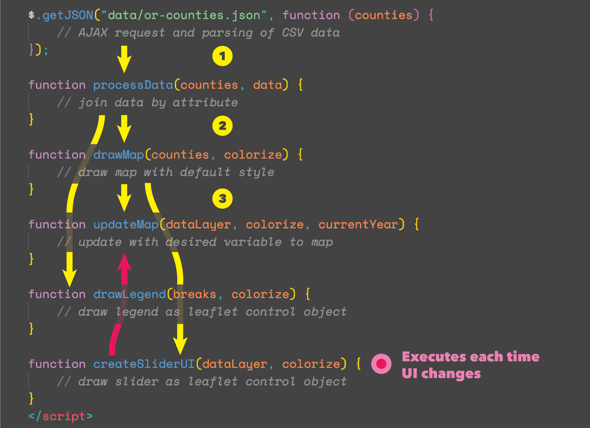     
*Flow of execution of map application*

## Visual design of the page and map

While visual design is one of the more challenging aspects of cartography and information design (as if the programming wasn't challenging enough!), here's a few design principles to keep in mind moving forward:

* Don't add color just for the sake of it. Start with a grayscale design and slowly add color either to encode information or to provide subtle highlights or to establish figure/ground (data/interface) relationships. Use subtle changes in hue (color) and contrast.
* Be consistent in how you design elements. If you've made your h1 and legend with an opaque gray background with rounded edges, make other elements containing UI controls or an information panel consistent with this look and feel.
* Use a single typeface, or at most two different fonts. Try Google's Fonts pairing recommendations for inspiration.
* Consider the visual hierarchy: what is most prominent in the overall design and where is the user's eye drawn first? Is this the entry point you want to explore the map? I.e., if you make the background a bright, highly saturated red color, this may ascend the visual hierarchy. Do you want your user to look at the background first?
* Whitespace is your friend. The goal of visual design isn't to crowd as much information into a small space as possible. In the web environment, you can use the *padding* and *margin* properties of elements' CSS rules to create space around elements affording a better visual balance.
* Show your design to people and elicit design critique. Visual design is an iterative process.


## Addendum: Diving into CSS for full-screen maps

You'll notice that unlike many of the previous page layouts, the map in our starter file fills the entire browser window. Let's take a moment to understand how we achieve this.

When we create (or "instantiate") a new Leaflet map, we use a div container with an `id` attribute of `map` to hold our Leaflet map (e.g., `<div id='map'></div>`). We've also been giving this HTML div element a specific height and width using CSS. We've typically specified the height in pixels, while the width has either been specified using a percentage or pixels:

```css
#map {
    width: 80%;
    height: 540px;
    margin: 10px auto;
}
```

OR

```css
#map {
    width: 960px;
    height: 540px;
    margin: 10px auto;
}
```

These techniques are suitable when we want to fix the map within specific dimensions within an overall page layout. But, suppose we want our map to fill the entire browser window? In one sense, this is beneficial because we don't necessarily need to make guesses about the user's screen resolution or browser size. The map will expand to the full extent. We would then place other elements (e.g., map titles, legends, interface controls, side panels) on top of the map itself.

How do we accomplish this?

Making a web map go full screen relatively easy to do with a few changes to the CSS rules we are applying to the `div` element that contains our Leaflet map. First, we're going to give it a CSS property of `position` with a value of `absolute`. The `position` CSS property is the key to mastering layout using CSS, and you should read more about [CSS Layout - The Position Property](http://www.w3schools.com/css/css_positioning.asp) and the [position CSS property](https://developer.mozilla.org/en-US/docs/Web/CSS/position).

You can apply the following CSS style rule to the `<div id="map"></div>` element to have the Leaflet map fill the entire screen:

```css
#map {
    position: absolute;
    width: 100%;
    top: 0;
    bottom: 0;
}
```

These CSS rules will expand that `div` element holding our Leaflet map to the entire viewport of the browser window.

In this case, the value of `absolute` will take our `map` element out of the "normal" flow of elements within the document and position it relative to its (non-static) parent element, which is the body. In other words, it positions the div element with its x/y origin point (its top, left corner pixel) in the upper left of the document body. Using CSS, we then give it a width of 100%, because we want it to fill the entire width of this body element. Two more declarations ensure that the top of the element is zero pixels from the top of the browser window, as well as zero pixels from the bottom.

With the map now taking up the entire viewport, how then do we see other document elements, such as our h1 tags? There are two strategies: using CSS absolute position or the [`L.Control()` class](http://leafletjs.com/reference-1.0.3.html#control). We'll explore both with this lesson.

To achieve this using CSS and absolute positioning, we again change the position of our HTML elements' `position` property from their default `static` value to `absolute` and position the element within the document using either the *top*, *right*, *bottom*, or *left* properties.

We modify our h1 element with the following CSS rules:

```css
h1 {
    position: absolute;
    z-index: 650;
    top: 10px;
    left: 60px;
    padding: 8px 15px;
    margin: 0;
    color: whitesmoke;
    font-size: 1.5em;
    background: rgba(25,25,25,0.8);
    border-radius: 5px;
}
```

As we see in the Leafet docs, the [Map Panes](http://leafletjs.com/reference-1.0.0.html#map-pane) use z-indexes 100 - 700. So, if we want our title on top of everything else, we need to give it a z-index of a higher value (but perhaps a value that will keep it placed beneath the tooltips and popups).

While most of those properties are used to achieve the desired aesthetic result (`padding`, `margin`, `color`, `font-size`, `background`, and `border-radius`), the first four are of particular importance for our layout. The `position: absolute` rule removes the h1 from the normal flow (i.e., from top to bottom) of positioning. The **z-index** property ensures that the `h1` element will be higher in the "stacking order" within the DOM than the div element containing our map (here we are assuming our `div` element holding our map has a z-index of less than 100). We use *top* and *left* to position the h1 element relative to the top,left (0,0) corner of its parent element (i.e., the document's `<body>` element).

**Tip:** When laying out elements using absolute position, and there is a problem with the stacking order (i.e., elements on top of each other but shouldn't be), try explicitly setting the z-index values for the elements involved. Also, if it appears that an element isn't being added to the DOM, such as this h1 element in the example, it may be stacked beneath the map and simply not visible.

